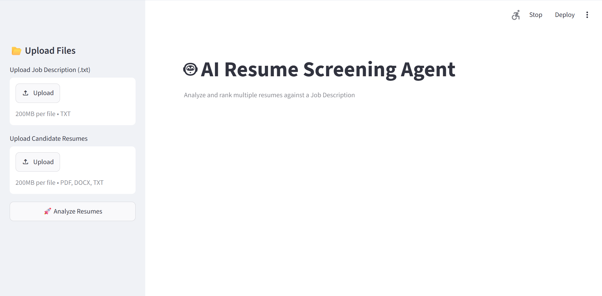
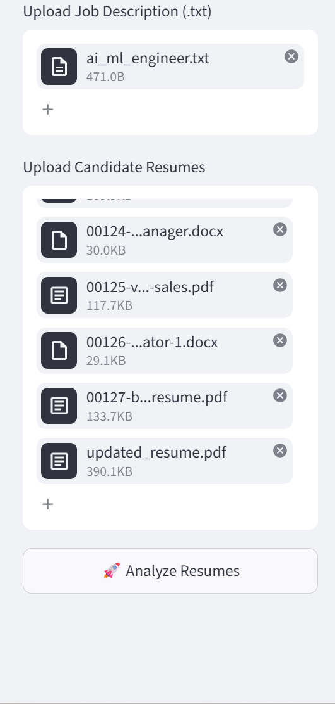
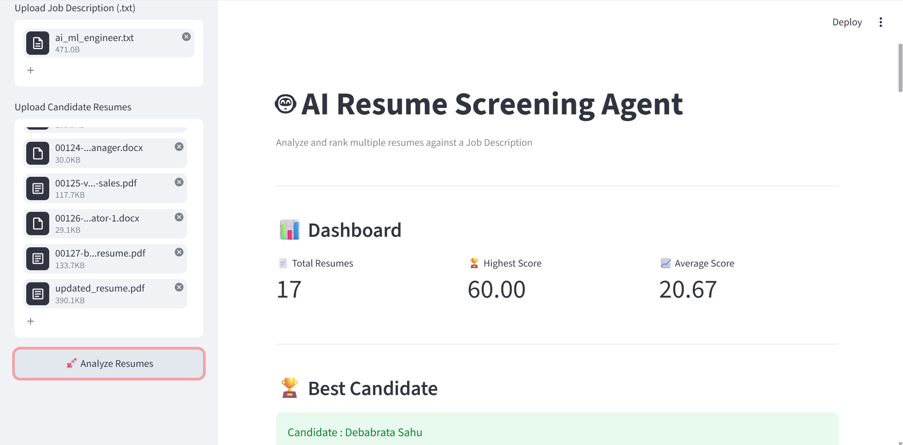
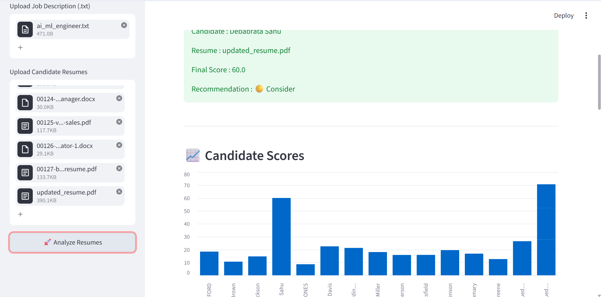

# 🤖 AI Resume Screening Agent

An AI-powered Resume Screening Agent that automates the recruitment process by analyzing multiple resumes, comparing them with a Job Description (JD), and ranking candidates using Natural Language Processing (NLP), semantic similarity, and hybrid scoring techniques.

The application provides a user-friendly Streamlit interface for uploading resumes and job descriptions, analyzing candidates, and exporting ranked results.

---

# 🚀 Features

## 📄 Resume Parsing
- PDF (.pdf)
- Microsoft Word (.docx)
- Plain Text (.txt)

## 👤 Candidate Information Extraction
- Name
- Email
- Phone Number

## 🧠 Resume Analysis
- Skill Extraction
- Education Extraction
- Experience Extraction

## 📋 Job Description Analysis
- Required Skills
- Required Education
- Required Experience

## 🤖 AI-Based Matching
- Sentence Transformer Embeddings
- Semantic Similarity Matching
- Hybrid Candidate Scoring

## 📊 Candidate Ranking
- Multi-Resume Screening
- Automatic Candidate Ranking
- Recommendation Labels
- Matched Skills
- Missing Skills

## 🖥 Streamlit Dashboard
- Upload Job Description
- Upload Multiple Resumes
- Interactive Dashboard
- Candidate Ranking Table
- Top Candidate Display
- Score Visualization
- CSV Download
- JSON Download

---

# 🛠 Technology Stack

## Programming Language
- Python 3.10

## AI / Machine Learning
- Sentence Transformers
- PyTorch
- spaCy
- Scikit-learn

## Data Processing
- Pandas
- NumPy

## Resume Parsing
- PyMuPDF
- python-docx

## Frontend
- Streamlit

---

# 📂 Project Structure

```text
Resume_Screening_Agent/
│
├── app.py
├── config.py
├── requirements.txt
├── README.md
│
├── data/
│   ├── resumes/
│   ├── job_descriptions/
│   ├── skills/
│   └── output/
│
├── resume_parser/
├── extractor/
├── embeddings/
├── scoring/
├── ranking/
└── tests/
```

---

# 🔄 Workflow

```text
                  Job Description
                         │
                         ▼
                 Parse Job Description
                         │
                         ▼
              Upload Candidate Resumes
                         │
                         ▼
            Extract Candidate Information
                         │
                         ▼
              Generate Text Embeddings
                         │
                         ▼
              Calculate Similarity Score
                         │
                         ▼
              Compute Hybrid Score
                         │
                         ▼
             Rank All Candidates
                         │
                         ▼
        Display Dashboard & Export Reports
```

---

# 📊 Scoring Strategy

The final candidate score is calculated using a weighted hybrid approach.

| Component | Weight |
|-----------|-------:|
| Semantic Similarity | 50% |
| Skill Matching | 30% |
| Education Matching | 10% |
| Experience Matching | 10% |

---

# 📥 Input

### Resume Formats
- PDF (.pdf)
- DOCX (.docx)
- TXT (.txt)

### Job Description
- TXT (.txt)

---

# 📤 Output

The application generates:

- Ranked Candidate List
- Candidate Recommendation
- CSV Report
- JSON Report

### Sample Output

| Rank | Candidate | Score | Recommendation |
|------|-----------|------:|----------------|
| 1 | Candidate A | 91.45 | 🟢 Highly Recommended |
| 2 | Candidate B | 87.32 | 🟢 Recommended |
| 3 | Candidate C | 72.18 | 🟡 Consider |

---

# ▶️ Installation

## 1. Clone Repository

```bash
git clone https://github.com/Deba-0075/AI-Resume-Screening-Agent.git
```

## 2. Move into the Project Folder

```bash
cd AI-Resume-Screening-Agent
```

## 3. Create Virtual Environment

```bash
python -m venv .venv
```

## 4. Activate Virtual Environment

### Windows

```bash
.venv\Scripts\activate
```

### Linux / macOS

```bash
source .venv/bin/activate
```

## 5. Install Dependencies

```bash
pip install -r requirements.txt
```

---

# ▶️ Run the Application

Start the Streamlit application:

```bash
streamlit run app.py
```

After running the command, Streamlit will display a local URL similar to:

```text
http://localhost:8501
```

Open the URL in your browser if it doesn't open automatically.

---

---

# 📸 Application Screenshots

## Home Screen



---

## Dashboard



---

## Candidate Ranking



---

## Candidate Details



---


# 📖 How to Use

1. Upload the Job Description (.txt)
2. Upload one or more resumes (.pdf, .docx or .txt)
3. Click **Analyze Resumes**
4. View the ranked candidate dashboard
5. Download the ranking results as CSV or JSON

---

# 📈 Future Enhancements

- OCR Support for Scanned Resumes
- LLM-powered Resume Analysis
- AI-generated Candidate Feedback
- Interview Question Generation
- Candidate Analytics Dashboard
- Database Integration
- Authentication & User Management

---

# 👨‍💻 Author

**Debabrata Sahu**

Computer Science Engineer | AI/ML & Computer Vision Enthusiast

📧 Email: sahudebabrata004@gmail.com

🔗 GitHub: https://github.com/Deba-0075

💼 LinkedIn: https://www.linkedin.com/in/debabrata-sahu-293ba0304

---

## ⭐ If you found this project useful, consider giving it a star on GitHub!